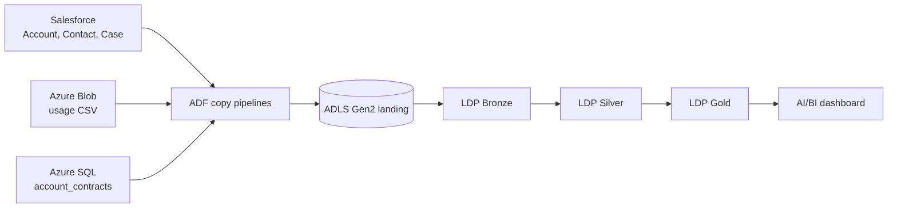
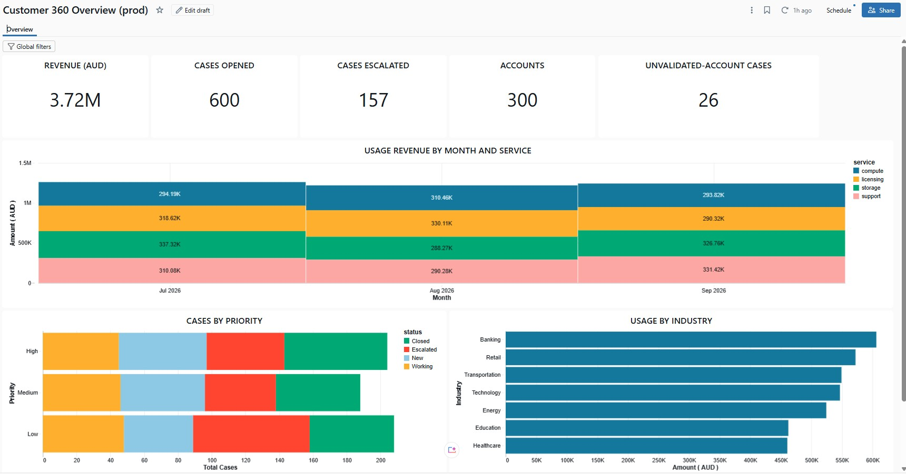

# Salesforce Customer 360 Lakehouse

A multi-source customer 360 lakehouse on Azure and Databricks. Azure Data Factory (ADF) copies data from Salesforce, Azure SQL and Azure Blob Storage into an ADLS Gen2 landing zone. Lakeflow Declarative Pipelines (LDP) then build Bronze, Silver and Gold layers on Unity Catalog, and a Databricks AI/BI dashboard sits on the Gold layer. Infrastructure is Terraform, deployment is Databricks Asset Bundles (DABs), and promotion is gated by tests in GitHub Actions.

> Contributions are not open at this time.

## What it does

- **Three sources, one landing zone:** ADF copies Salesforce Account, Contact and Case objects, a usage CSV from Blob Storage, and an `account_contracts` table from Azure SQL into the landing container.
- **Medallion layers:** Bronze ingests the landed files with Auto Loader. Silver applies per-entity quality rules, sends failing rows to quarantine tables, and keeps current state with auto CDC (SCD Type 1). Gold builds dimensions, facts and aggregates. Bronze and Silver tables are defined from registries (`registry.py`), so adding an entity is a registry entry.
- **Contract enrichment:** Azure SQL contract data adds a `contract_tier` to the account dimension and feeds a separate committed-versus-actual usage table.
- **Dashboard:** a Databricks AI/BI dashboard, deployed through DABs and parameterised per environment.

## Architecture

## Data

All data is synthetic. A seeded generator in `data_generator/` creates the Salesforce records (300 Accounts, 500 Contacts, 600 Cases in a Salesforce Developer Edition org), the usage file, and the contract rows loaded into Azure SQL. Names, emails, phone numbers and bank names are localised for Australia. No real customer data is used.

## Repository layout

| Path | Contents |
|---|---|
| `adf/` | Exported ADF factory: datasets, linked services and copy pipelines (Git-integrated on `develop`) |
| `ldp_pipelines/` | LDP pipeline code for Bronze, Silver and Gold |
| `utils/` | Pure transform functions used by the pipelines and unit tests |
| `resources/`, `databricks.yml` | Asset Bundle config: the pipeline, the dashboard and the test-suite job |
| `src/` | Dashboard definition (`customer_360.lvdash.json`) |
| `infra/terraform/` | Azure infrastructure: Databricks storage credential and Unity Catalog, ADF, source storage, Azure SQL |
| `data_generator/` | Synthetic data generator and the Azure SQL loader |
| `sql/` | Azure SQL setup scripts and a job-health query over system tables |
| `tests/` | `unit`, `integration` and `e2e` tiers |
| `docs/` | Cloud requirements and dashboard snapshots |
| `.github/` | Workflows for each gate, and exported branch rulesets |

## Environments and promotion gates

Work moves `develop` → `staging` → `main`. The bundle has `dev`, `staging` and `prod` targets, each with its own Unity Catalog catalog, in one workspace.

| Event | Gate | What runs |
|---|---|---|
| Push to `develop` | Unit tests | Transform and registry tests |
| Pull request into `staging` | Integration test | Gold row counts and revenue totals reconcile with Silver |
| Pull request into `main` | End-to-end test | The Gold tables behind the dashboard's headline numbers match known values (300 accounts, 600 cases, 3,721,662.94 revenue) |

Rulesets (exported in `.github/rulesets/`) require pull requests, merge commits only and the integration or e2e check on `staging` and `main`, with no bypass actors. Direct pushes to those branches are rejected, including for the owner. `develop` only blocks deletion and force-pushes, because ADF Studio commits to it directly.

## Dashboard

The dashboard shows revenue, cases opened and escalated, and account counts, with usage revenue by month and service, cases by priority and status, and usage by industry. Full PDF: [`Customer 360 Overview.pdf`](docs/dashboards/Customer%20360%20Overview.pdf)

## Design decisions

- **ADF for extraction, Databricks for transformation.** Three different source types is the reason ADF is here. A single source would go straight into Databricks.
- **No secrets in git.** Salesforce is reached through an External Client App using the client credentials flow, and the client secret lives in Key Vault. Azure SQL is reached with Entra tokens and a managed identity user, with no passwords.
- **Current contract, one row per account.** Silver contracts are SCD Type 1 keyed on contract, and Gold selects each account's current contract with `ROW_NUMBER`. A separate Gold table holds committed-versus-actual usage, so the validated headline numbers stay stable.
- **Environments at catalog level.** One workspace with separate catalogs per stage (`salesforce_dev`, `salesforce_staging`, `salesforce_prod`).
- **The dashboard is code.** It is deployed through DABs and resolves its SQL warehouse by name, so the same definition runs in every environment.
- **Bad rows are quarantined, not dropped.** Rows failing a Silver expectation go to `_quarantine` tables, keeping the latest version per record.
- **Failure alerts.** The pipeline and the test-suite job email on failure.

## Engineering notes

1. **A join fan-out inflated the numbers.** Five accounts have two contract rows after a renewal. A naive join took `dim_account` from 301 rows to 306 and revenue from 3,721,662.94 to 3,771,008.68, and the e2e test failed. Selecting the current contract per account restored 301 rows and the original revenue. A one-row-per-account test now guards the grain.
2. **A serverless SQL warehouse cost spike.** A Small warehouse with a 10-minute auto-stop left an idle tail that drove up cost. It is now 2X-Small with a 5-minute auto-stop.

## Decisions made for a solo, scaled-down build

- One landing zone shared by all environments.
- The project reuses the Databricks workspace and storage account of my [TfNSW lakehouse project](https://github.com/AiEnthu2026/tfnsw-transit-lakehouse), with its own container, access connector and catalogs.
- Personal access token for CI, not a service principal with OIDC.
- No required reviewers between stages (solo project).
- The storage account name appears in the ADF landing linked service JSON. It is an identifier, not a credential; access needs Entra authentication.
- The workspace host is committed in `databricks.yml` deliberately, so a misconfigured CI variable cannot send a deploy to another workspace. It is an identifier, not a credential.

## Known gaps

- The Network Security Perimeter associations are in learning mode, not Enforced.
- The Key Vault holding the Salesforce secret was created by hand and is not yet in Terraform.
- Contracts are SCD Type 1, with renewals modelled as new contracts. SCD Type 2 is the next step, and incremental loads of changed contracts are untested.
- ADF copies to landing, but triggering the Databricks pipeline from ADF is a planned step.
- Revenue band is `Unknown` for every account because the generator sets no annual revenue. The banding logic is unit tested.
- Twenty-six cases map to an `UNKNOWN` account; their origin has not been confirmed.

## Data and trademarks

This is a personal learning project using synthetic data. It is not affiliated with or endorsed by Salesforce, Microsoft or Databricks. All trademarks belong to their owners.